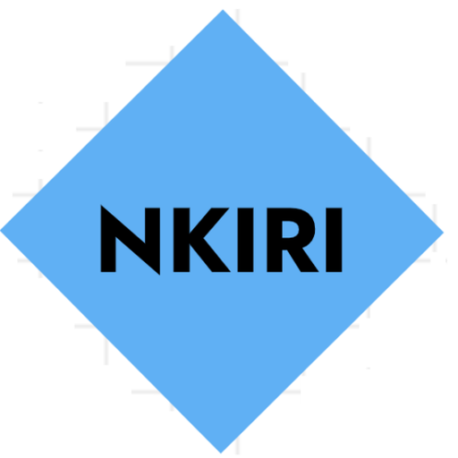

<p align="center">
  
</p>

<h1 align="center">Nkiri TV</h1>

<p align="center">
  A high-performance, client-side streaming application for movies, series, and dramas with TV-optimized navigation, direct MKV stream resolution, and a responsive glassmorphic UI. Built with Python and Flet.
</p>

<p align="center">
  
  
  <br>
  
</p>

---

## Download

Get the latest version of Nkiri TV. If you aren't sure which Android version to pick, choose the **Universal** APK.

| Platform | Download | Size | Notes |
|:--------:|:--------:|:----:|:------|
| 🤖 **Android (Universal)** | [**nkiri-tv.apk**](https://github.com/Nwokike/nkiri-tv/releases/latest/download/nkiri-tv.apk) | ~120 MB | Works on all Android devices (ARM64, ARMv7, x86_64) |
| 🤖 **Android (ARM64)** | [**nkiri-tv-arm64-v8a.apk**](https://github.com/Nwokike/nkiri-tv/releases/latest/download/nkiri-tv-arm64-v8a.apk) | ~50 MB | For modern 64-bit Android devices and TVs |
| 🤖 **Android (ARM32)** | [**nkiri-tv-armeabi-v7a.apk**](https://github.com/Nwokike/nkiri-tv/releases/latest/download/nkiri-tv-armeabi-v7a.apk) | ~45 MB | For older 32-bit Android devices and older Firesticks |
| 🤖 **Android (x86_64)** | [**nkiri-tv-x86_64.apk**](https://github.com/Nwokike/nkiri-tv/releases/latest/download/nkiri-tv-x86_64.apk) | ~55 MB | For Android emulators / ChromeOS |
| 🪟 **Windows** | [**Nkiri_TV_Setup.exe**](https://github.com/Nwokike/nkiri-tv/releases/latest/download/Nkiri_TV_Setup.exe) | ~80 MB | Windows 10/11 Installer (64-bit) |
| 🍎 **macOS** | *Coming soon* | — | |
| 📱 **iOS** | *Coming soon* | — | |

---

## Screenshots

*Coming soon.*

---

## Features

- **Browse & Search** — Paginated content discovery across 10+ categories (K-Drama, Bollywood, Asian Movies, Philippine Movies, Chinese Dramas, and more) with real-time search and poster previews.
- **Episode Grid** — Snapshot-based episode cards with pagination, season/episode labels, and file size display.
- **Direct MKV Stream Resolution** — Automatic downloadwella link resolution for direct `.mkv` streaming via HTTP range requests. No full download required.
- **KTV Player Integration** — Optional external player deep-link support (`ktv://play?url=<base64>`) for monetization. Toggle between internal `flet-video` and external player.
- **TV Remote Navigation** — Full D-pad support with sequential tab indexing, focus ring highlights, and hover effects. Optimized for Android TV, Fire Stick, and Leanback.
- **Adaptive Scraper** — WordPress REST API parser with downloadwella direct link resolver. In-memory + SQLite caching with TTL expiration.
- **System Theme Awareness** — Automatically follows device light/dark mode with manual override. Emerald green cinematic palette.
- **Responsive Layout** — SafeArea-wrapped, ListView-scrollable views that adapt from phone to TV screen sizes.

## Architecture

| Layer | Technology |
|-------|-----------|
| Frontend | Flet 0.85 (Python → Flutter) |
| Video Engine | `flet-video` (libmpv backend) |
| Network | `requests` (sync, connection pooling, 15s timeout) |
| Cache | `aiosqlite` (WAL-mode SQLite with TTL) + in-memory LRU |
| Stream Resolver | downloadwella POST → regex direct `.mkv` extraction |
| Content Source | Nkiri WordPress REST API (`/wp-json/wp/v2/posts`) |
| State Management | Flet `@observable` reactive state with page-scoped view builders |
| Routing | Flet declarative routing with view stack management |
| Navigation | Sequential `tab_index` D-pad focus chain across all interactive elements |

### Project Structure

```
src/
├── main.py                 # App entry, routing, global back handler, theme init
├── core/
│   ├── config.py           # Feature flags (internal/external player toggle)
│   ├── state.py            # @observable reactive state (AppState)
│   ├── theme.py            # Light/dark color schemes, glass bg helpers
│   └── focus_manager.py    # Global keyboard/back event handler for TV remotes
├── views/
│   ├── splash.py           # Animated splash with auto-transition
│   ├── home.py             # Category chips + content grid + pagination + D-pad focus
│   ├── search.py           # Search bar + results grid + D-pad focus
│   ├── content_detail.py   # Content info + episode grid + pagination + D-pad
│   └── player.py           # flet-video player with stream resolution overlay
├── services/
│   ├── nkiri.py            # WordPress API scraper + downloadwella resolver
│   └── cache.py            # Async SQLite cache with TTL
└── components/
    ├── player/             # Player components (future)
    └── ui/                 # Reusable UI components (future)
```

### Stream Resolution Pipeline

```
User clicks episode
    │
    ▼
scraper.resolve_episode(downloadwella_url)
    │
    ├── POST op=download2 to downloadwella.com
    │
    ├── regex: https://dwbe*.downloadwella.com/d/*.mkv
    │
    └── fallback: regex scan for any .mkv URL
                                        │
                                        ▼
video.playlist = [VideoMedia(mkv_url)] ┘
```

### D-Pad Navigation Model

Every interactive element is assigned a sequential `tab_index` so Android's `FocusFinder` can navigate with arrow keys:

```
Home:    Search(1) → Theme(2) → Cards(3..N) → Prev(N+1) → Next(N+2)
Search:  Back(1) → SearchBtn(2) → Cards(3..N)
Detail:  Back(1) → Episodes(2..N) → Prev(N+1) → Next(N+2)
Player:  Back(1)
```

Focus highlights are applied via `on_focus`/`on_blur` callbacks that animate scale, shadow, and border color.

## Development

```bash
# Clone and set up
git clone https://github.com/Nwokike/nkiri-tv.git
cd nkiri-tv
uv sync

# Run in development
flet run

# Build for Android
flet build apk --release

# Build for Windows
flet build windows --release
```

## Legal Disclaimer

Nkiri TV is a media player and network utility. It does not host, store, or distribute any copyrighted content. The app interfaces with publicly available APIs and web pages. Users are solely responsible for ensuring compliance with applicable laws and terms of service in their jurisdiction.
